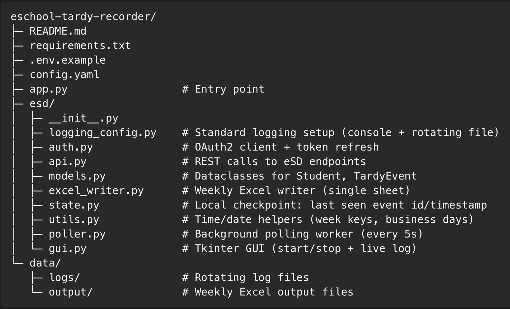

# eSchool Tardy Recorder

Polls eSchool (eSD GURU) attendance endpoints every 5 seconds and writes rows to a weekly Excel file.

## Features
- OAuth2 with automatic token refresh
- Polling interval: 5 seconds
- Monday–Friday only (skips weekends automatically)
- Single worksheet per file with columns: `Name | ID | Grade | Timestamp | Date`
- One Excel file per ISO week: `TardyLogs_YYYY-WW.xlsx`
- GUI (Tkinter): Start/Stop, status, live log view
- Rotating file logs in `data/logs/`
- Duplicate-safe via local checkpoint (`.state.json`)

## Quick Start
1. **Python 3.10+** recommended.
2. `pip install -r requirements.txt`
3. Copy `.env.example` → `.env` and fill credentials.
4. Edit `config.yaml` for your base URL and endpoint paths.
5. Run: `python app.py`

## Configuration
- `.env` holds secrets (client id/secret, tenant, etc.)
- `config.yaml` holds non-secret runtime options and endpoint paths.

PROJECT STRUCTURE




## Packaging (Optional)
- Create a standalone app with PyInstaller:
  ```bash
  pyinstaller --noconfirm --clean --onefile --name TardyRecorder app.py